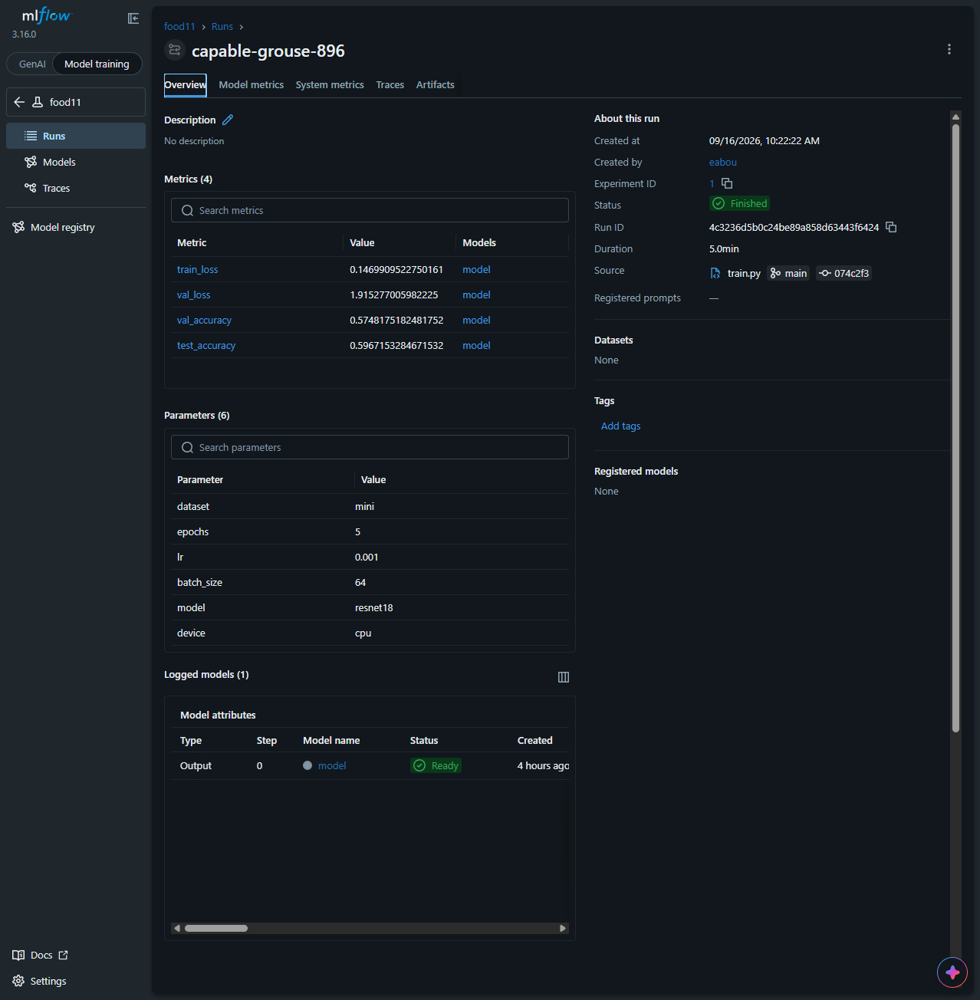
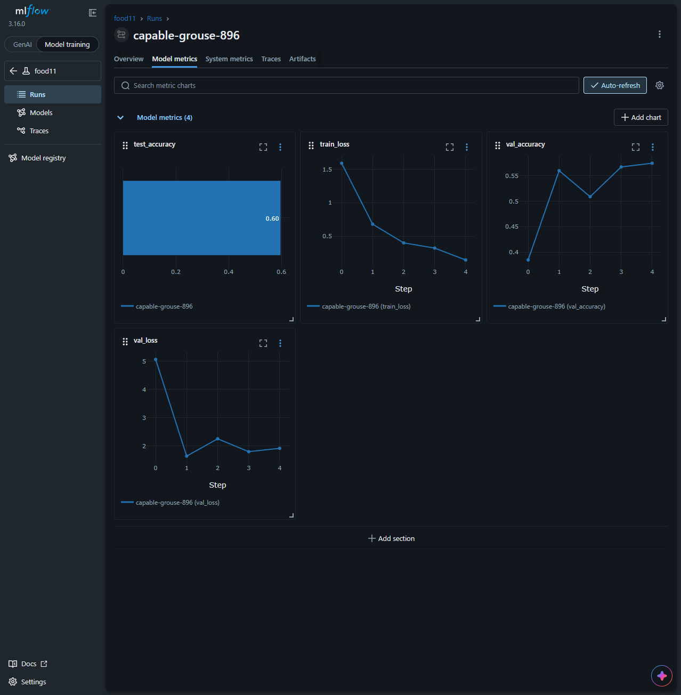
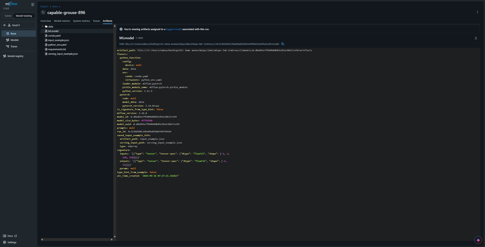
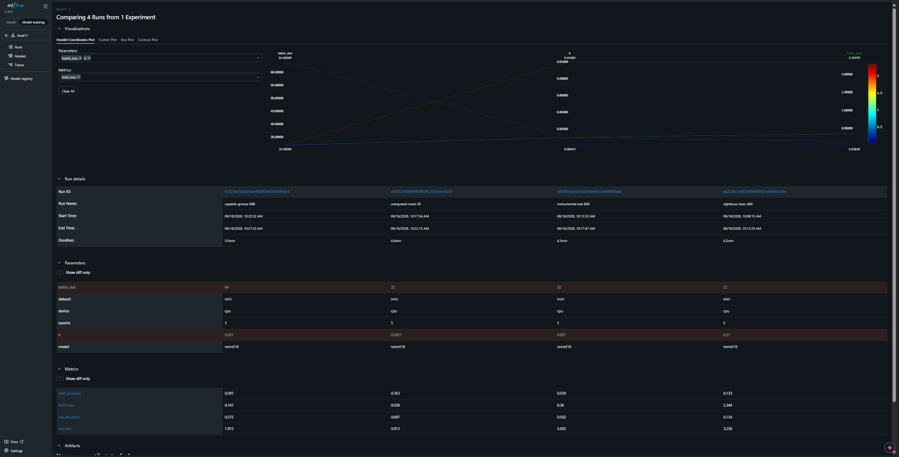
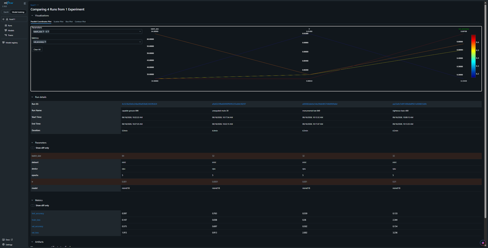
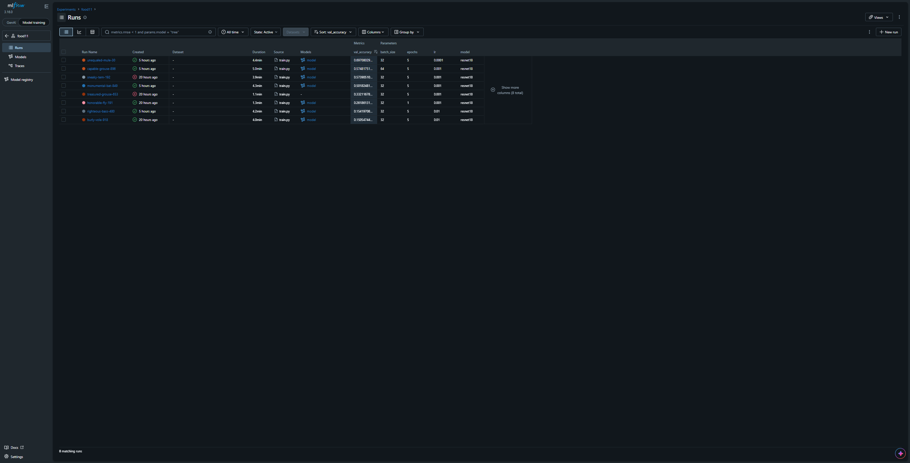

# Lab 2 - Answers

> **Matricule:** 231833
> **Full Name:** Naji Bou Zeid
> **Group:** MLOps grp 7
> **Date:** 16-9-2026

## Question 1: Look at pyproject.toml and uv.lock. What changed?

Running `uv add mlflow torch torchvision scikit-learn` added four new top-level dependencies to `pyproject.toml`'s dependency list. `uv.lock` changed far more — it resolved and pinned exact versions (and hashes) for all 122 packages in the dependency tree, since `mlflow`, `torch`, `torchvision`, and `scikit-learn` each pull in a long chain of their own dependencies (e.g. `sqlalchemy`, `flask`, `pandas`, `numpy`, `sympy`, `pyyaml`, and many more). 98 packages actually got installed into the local `.venv`, matching the resolved lock entries.

## Question 2: What is `--backend-store-uri` used for? What is `--default-artifact-root` used for? What is the difference between the metadata mlflow stores and the artifacts it stores?

`--backend-store-uri` tells the mlflow server where to store **run metadata** — params, metrics, tags, run status, timestamps. In our setup this is `sqlite:///mlflow.db`, a local SQLite database file.

`--default-artifact-root` tells the server where to store **artifacts** — actual files produced by a run, like the saved model weights, plots, or any other output logged with `mlflow.log_artifact`. In our setup this is `./mlruns`.

The core difference: metadata is small, structured, queryable data (numbers, strings, key-value pairs) that lives in a database so the UI can filter/sort/chart it quickly. Artifacts are arbitrary files/blobs (potentially large, like a full model checkpoint) that just need to be stored and retrieved by path — not queried or indexed the way metadata is.

## Question 3: Why shouldn't `mlflow.db` and `mlruns/` be tracked by git, and why shouldn't they be tracked by dvc either?

Neither `mlflow.db` nor `mlruns/` should go in **git**, because `mlflow.db` is a binary SQLite file that changes on every single training run — git would show a meaningless, unreadable diff each time, and if two people ran experiments and both pushed, the database files would conflict in a way git can't merge.

`mlruns/` has the same underlying problem in a different shape: it's a folder that grows a new set of files with every run (including potentially large model checkpoint files logged as artifacts), so committing it would bloat the repo with binary blobs that have nothing to do with the actual source code, and every teammate running their own experiments would generate a different, conflicting `mlruns/` tree.

They shouldn't go in **dvc** either, for a related but different reason: dvc is for deliberately versioning specific, meaningful snapshots of data (like our Food-11 dataset) that we want to track and restore later. `mlflow.db`/`mlruns/` aren't a dataset we're curating — they're ephemeral, constantly-changing local state generated automatically by the tracking server itself. mlflow *is* the tool responsible for tracking and versioning this experiment history; duplicating that responsibility into dvc as well would be redundant and wouldn't make sense to "checkout" the way we checkout a data snapshot.

## Question 4: What happens the first time you call `set_experiment` with a name that doesn't exist yet? Check the mlflow UI.

The first time `mlflow.set_experiment("food11")` is called with a name that doesn't exist yet, mlflow automatically creates a new experiment with that name. This showed up directly in the terminal output:

```
INFO mlflow.tracking.fluent: Experiment with name 'food11' does not exist. Creating a new experiment.
```


Checking the mlflow UI confirms it — the `food11` experiment now appears in the Experiments list alongside the default "Default" experiment that exists from the start.

## Question 5: What is the difference between `mlflow.log_param` and `mlflow.log_metric`? Why does `log_metric` take a `step` argument and `log_param` doesn't?

`mlflow.log_param` records a value that's fixed for the entire run — a hyperparameter chosen before training starts (learning rate, batch size, number of epochs) and never changes afterward. `mlflow.log_metric` records a value that's expected to evolve *during* the run (loss, accuracy) — something measured repeatedly over time.

That's exactly why `log_metric` takes a `step` argument and `log_param` doesn't: a metric is a time series (one value per epoch/iteration), so mlflow needs to know *which point in training* each value corresponds to, in order to plot it as a chart. A param is a single, unchanging value — there's no "step" to attach it to, since it's the same before, during, and after training.

## Question 6: Open the run in the mlflow UI. Find the params, the metric charts, and the logged model artifact. Where does the model artifact actually live on disk?

Opening the run `capable-grouse-896` in the mlflow UI, the **Overview** tab shows the **Parameters** table (`dataset`, `epochs`, `lr`, `batch_size`, `model`, `device`) and the **Metrics** table (`train_loss`, `val_loss`, `val_accuracy`, `test_accuracy` with their final values). The **Model metrics** tab shows the same metrics as line charts across epochs. The **Artifacts** tab, under the associated logged model, shows files like `MLmodel`, `conda.yaml`, `requirements.txt`, `input_example.json` — this is the logged PyTorch model.







The `MLmodel` file's own content confirms exactly where the artifact lives on disk — its `artifact_path` field points to:

file:///C:/Users/eabou/Desktop/USJ 3eme annee/mlops/labs/mlops-lab-1/mlruns/1/models/m-d8a9b1e7fb904ddb85e2b1e36b17ce54/artifacts/MLmodel

So concretely, since `--default-artifact-root` was set to `./mlruns`, the model artifact lives under `mlruns/<experiment_id>/models/<model_id>/` inside the project folder.

## Question 7: In the mlflow UI, open the `food11` experiment. Select these runs and click "Compare". Which learning rate gave the best `val_accuracy`? Is higher always better?

Comparing the four runs on the mlflow Compare page confirms it directly — the Run Details table shows exact params and metrics side-by-side:

| Run | lr | batch_size | val_accuracy | test_accuracy |
|---|---|---|---|---|
| unequaled-mule-30 | 0.0001 | 32 | 0.697 | 0.763 |
| capable-grouse-896 | 0.001 | 64 | 0.575 | 0.597 |
| monumental-bat-849 | 0.001 | 32 | 0.502 | 0.559 |
| righteous-bass-480 | 0.01 | 32 | 0.154 | 0.133 |



`lr=0.0001` gave the best `val_accuracy` (0.697) and the best `test_accuracy` (0.763), clearly ahead of the other three. So **no, higher is not always better** — `lr=0.01` performed the worst by far (`val_accuracy` of just 0.154, barely above random guessing for 11 classes), while the smallest learning rate tested let the pretrained resnet18 fine-tune the most effectively over 5 epochs.

## Question 8: Use the parallel coordinates plot on the compare page to look at `lr`, `batch_size` and `val_accuracy` together. What pattern do you see?

Using the parallel coordinates plot with `lr`, `batch_size`, and `val_accuracy`:



The dominant pattern is that `lr` drives most of the spread in `val_accuracy`, while `batch_size` has a much smaller effect. The line for `lr=0.01` (righteous-bass-480) dips to the lowest `val_accuracy` on the right axis (0.154), regardless of its `batch_size=32`. The line for `lr=0.0001` (unequaled-mule-30) reaches the highest `val_accuracy` (0.697), also at `batch_size=32`. Comparing the two `lr=0.001` runs — `batch_size=32` (monumental-bat-849, val_accuracy 0.502) vs. `batch_size=64` (capable-grouse-896, val_accuracy 0.575) — the gap between them is much smaller than the gap caused by changing `lr` alone. So the plot makes clear that `lr` is the variable that matters most for this sweep, and `batch_size` only shifts the result slightly within whatever range `lr` has already set.

## Question 9: Sort the runs table by `val_accuracy` descending. Which run is the best one? Note its run ID, you'll need it in the next lab.

Sorting the runs table by `val_accuracy` descending confirms it directly:


`unequaled-mule-30` sits at the top with `val_accuracy` of 0.697.
Opening the run confirms its full details:



trained with `lr=0.0001`, `batch_size=32`, `epochs=5`, `dataset=mini` — `val_accuracy` 0.6971, `test_accuracy` 0.7628.

**Run ID:** `a9af223f8a68490f9095255ebfe38297`